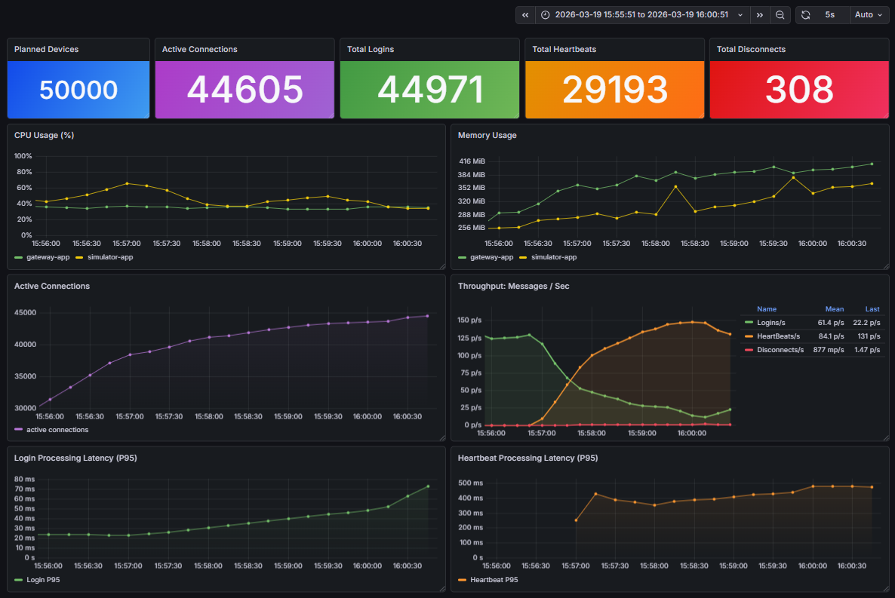
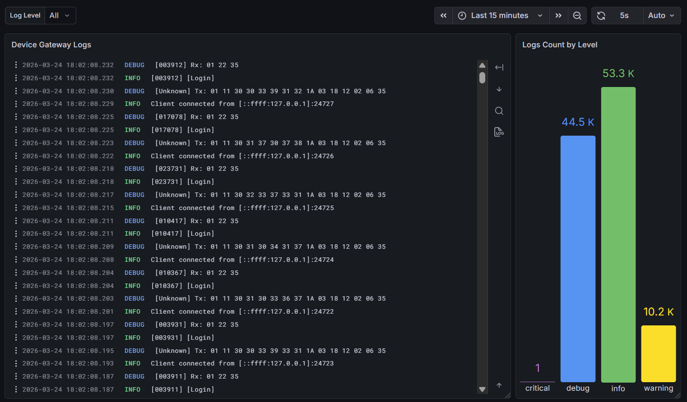
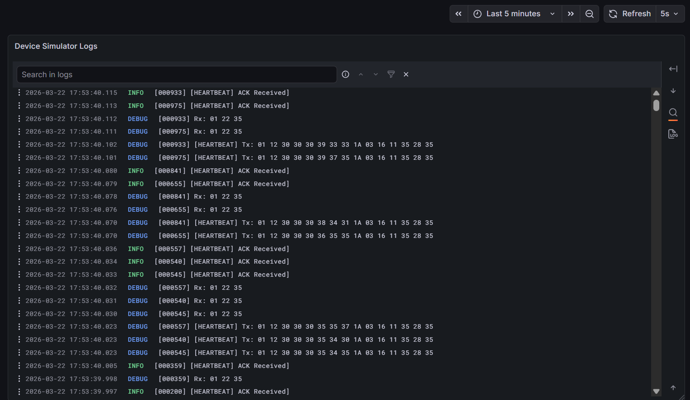

## 🚧 Project Status: Work in Progress (WIP)


**Status:** Actively under development.  

---

## Scalable TCP Device Gateway

### 🚀 Overview
This is a **high-concurrency TCP server** designed to handle thousands of simultaneous device connections with minimal overhead. It serves as a robust gateway for IoT or industrial device communication.

- **Tracks:** Login, Heartbeat, and Disconnect messages.
- **Metrics:** Exposes Prometheus metrics for real-time monitoring.
- **Visualization:** Integrated with Grafana dashboards.
- **Logging:** Centralized logging using **Grafana Loki**.
- **Performance:** Built with **.NET 10 (LTS)** and `System.IO.Pipelines`.

---

### 🛠 Tech Stack
- **Framework:** .NET 10 (LTS)
- **Networking:** `System.IO.Pipelines` (High-performance I/O)
- **Monitoring:** Prometheus & Grafana
- **Logging:** Grafana Loki
- **CI/CD:** GitHub Actions
- **Infrastructure:** Docker Compose (Monitoring Stack)

---

### 📊 Dashboard & Observability
The integrated Grafana dashboard provides real-time insights by correlating metrics (Prometheus) with application logs (Loki).






#### Metrics Exposed
- `gateway_devices_expected_total`: The target number of devices configured for this simulation run.
- `gateway_active_connections`: Current established TCP sessions.
- `gateway_logins_total`: Total successful handshakes completed.
- `gateway_heartbeats_total`: Total heartbeats processed.
- `gateway_disconnects_total`: Count of socket closures, including both simulated drops and server-side disconnects.
- `gateway_login_duration_seconds`: Latency tracking for handshake sequences.
- `gateway_heartbeat_duration_seconds`: Tracks how long the server takes to respond to a heartbeat request.

---

### 🔄 Connection Lifecycle
1. **Connect:** Device establishes a TCP socket.
2. **Login:** Device must send a valid `Login` message within a defined window to be registered.
3. **Stay Alive:** Device sends periodic `Heartbeat` messages to maintain the session.
4. **Disconnect:** Automatically handled when the socket is closed or a heartbeat timeout is triggered.

---

### ⚡ How to Run

#### 1. Start the Monitoring Stack
#### Launch Prometheus, Loki, and Grafana using Docker Compose:
```bash
docker-compose up
```
- Prometheus: http://localhost:9090
- Grafana: http://localhost:3000 (Default: admin/admin)

#### 2. Run the Server
```bash
dotnet run --project Gateway.Server/Gateway.Server.csproj
```
- Verify that metrics are working at: http://localhost:2222
  
#### 3. Run the Simulator
```bash
dotnet run --project Device.Simulator/Device.Simulator.csproj
```
- Verify that metrics are working at: http://localhost:3333

#### 4. Import the Dashboards
1. Open Grafana and go to **Dashboards → Import**.
2. Import one of the following JSON files from the `Dashboards/` directory:

   - `Dashboards/Images/ScalableTcpDeviceGateway_Metrics.json`
   - `Dashboards/Images/DeviceGateway_Logs.json`
   - `Dashboards/Images/DeviceSimulator_Logs.json`
3. Paste the JSON model or upload the file and click **Import**.


--- 
### Troubleshooting
- **Loki Connectivity**: If logs aren't appearing, ensure the Loki container is running and the **Serilog** configuration in the Gateway points to the correct endpoint.
- **Grafana Dashboards**: If dashboards do not load, ensure all Docker containers are in a Running state.

