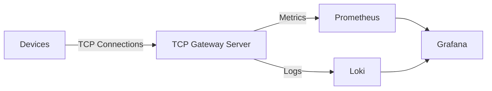

# Scalable TCP Device Gateway


**Status:** Actively under development.

---

### 🚀 Overview

A high-performance IoT gateway capable of 10k+ concurrent connections, achieving near-zero allocation on the hot path
via .NET 10 and `System.IO.Pipelines`

---

### ❓ Why this project?

In IoT and industrial automation, handling thousands of concurrent "chatty" devices is a common bottleneck. Traditional `async/await` patterns over standard streams can lead to high GC pressure and memory fragmentation under extreme load.

This project demonstrates:
- **High-Performance Networking:** Engineering a zero-copy TCP provider using `System.IO.Pipelines` to eliminate GC overhead.
- **Cloud-Native Observability:** Implementing a "Golden Signals" monitoring stack with Prometheus, Grafana, and Loki.
- **Advanced Concurrency:** Managing thousands of stateful device sessions using thread-safe, low-overhead patterns.

---

### ✨ Key Features

- **High-Concurrency Engine:** Built with `System.IO.Pipelines` for non-blocking, zero-copy
  I/O.
- **Zero-Allocation Parsing:** Uses `ReadOnlySequence<byte>` to process streams without heap allocations.
- **Memory Efficiency:** Commands modeled as `readonly record structs` and `Span<T>` to keep data on the stack.
- **Full Observability:** Integrated Prometheus metrics, Grafana dashboards, and Loki logs for real-time monitoring.
- **Built-in Load Testing:** Custom `Device.Simulator` to stress-test backpressure and throughput.

---

### 🛠 Tech Stack

- **Framework:** .NET 10 (LTS)
- **Networking:** `System.IO.Pipelines` (High-performance, low-latency socket I/O)
- **Memory Management:** `ArrayPool<T>` and `Span<T>` for buffer management.
- **Observability:** Prometheus (Metrics), Grafana (Visualization), and Grafana Loki (Logging).
- **CI/CD:** GitHub Actions (Automated build & test).
- **Infrastructure:** Docker Compose (Monitoring stack).

---

### ⚡ Performance & Design Highlights

| Feature                 | Technical Implementation  | Impact                                           |
|:------------------------|:--------------------------|:-------------------------------------------------|
| Zero-Allocation Parsing | `ReadOnlySequence<byte>`  | Eliminates intermediate string/array copies.     |
| Backpressure            | `PipeReader / FlushAsync` | Pauses reading if the buffer exceeds capacity.   | 
| GC Pressure             | `readonly record structs` | Keeps data on the stack; minimizes object churn. | 
| I/O Efficiency          | `ValueTask`               | Reduces overhead for asynchronous operations.    | 

<details>
<summary><b>🚀 Benchmark Metrics (Zero-Allocation)</b></summary>

| Operation | Encoding | Decoding | Total Latency | Allocated |
|:----------|:---------|:---------|:--------------|:----------|
| Login     | 18.24 ns | 64.29 ns | 82.53 ns      | 0 B       |
| Heartbeat | 14.07 ns | 54.55 ns | 68.62 ns      | 0 B       |
| Ack       | 1.07 ns  | 36.71 ns | 37.78 ns      | 0 B       |

Note: Benchmarked using BenchmarkDotNet on the hot-path message loop
</details>

---

### 📦 Protocol Specification

Data is transmitted as a packed binary stream for maximum efficiency.

---

### 🏗 Architecture Diagram



---

### 📊 Observability & Monitoring

The system provides a "Single Pane of Glass" view into the gateway's health using Prometheus for telemetry and Grafana
Loki for distributed logging.

<details>
<summary><b>View Dashboard Screenshots</b></summary>

#### Real-time tracking of 10k+ active sessions and handshake latencies:


##### Metrics Exposed:

- `gateway_devices_expected_total`: The target number of devices configured for this simulation run.
- `gateway_active_connections`: Current established TCP sessions.
- `gateway_logins_total`: Total successful handshakes completed.
- `gateway_heartbeats_total`: Total heartbeats processed.
- `gateway_disconnects_total`: Count of socket closures, including both simulated drops and server-side disconnects.
- `gateway_login_duration_seconds`: Latency tracking for handshake sequences.
- `gateway_heartbeat_duration_seconds`: Tracks how long the server takes to respond to a heartbeat request.

#### Structured logs correlated with metric spikes for rapid debugging:


</details>

---

### 🔄 Connection Lifecycle

1. **Connect:** Device establishes a TCP socket.
2. **Login:** Device must send a valid `Login` message within a defined window to be registered.
3. **Stay Alive:** Device sends periodic `Heartbeat` messages to maintain the session.
4. **Disconnect:** Automatically handled when the socket is closed or a heartbeat timeout is triggered.

---

### 📂 Project Structure

```text
├── Gateway.Server/          # Core TCP engine (Pipelines & socket handling)
├── Gateway.Protocol/        # Protocol parsing & encoding
├── Gateway.Protocol.Tests/  # Unit tests
├── Benchmarks/              # BenchmarkDotNet suites
├── Gateway.Monitoring/      # Metrics & observability logic
├── Device.Simulator/        # Load testing tool
├── Dashboards/              # Grafana dashboards & images
├── prometheus/              # Prometheus configuration
└── docker-compose.yaml      # Monitoring stack setup
```

---

### 🔄 Connection Lifecycle

1. **Connect:** Device establishes a TCP socket.
2. **Login:** Device must send a valid `Login` message within a defined window to be registered.
3. **Stay Alive:** Device sends periodic `Heartbeat` messages to maintain the session.
4. **Disconnect:** Automatically handled when the socket is closed or a heartbeat timeout is triggered.

---

### 📋 Prerequisites

- .NET 10 SDK (or later)
- Docker & Docker Compose

---

### ⚡ How to Run

#### 1. Start Monitoring Stack

```bash
docker-compose up -d
```

- Prometheus: http://localhost:9090
- Grafana: http://localhost:3000 (Default: admin/admin)

#### 2. Run the Server

```bash
dotnet run --project Gateway.Server/Gateway.Server.csproj
```

- Verify Metrics: http://localhost:2222

#### 3. Run the Load Simulator

```bash
dotnet run --project Device.Simulator/Device.Simulator.csproj
```

- Verify Metrics: http://localhost:3333

#### 4. Import Dashboards

1. Open Grafana and go to **Dashboards → Import**.
2. Import one of the following JSON files from the `Dashboards/` directory:
    - `Dashboards/Images/ScalableTcpDeviceGateway_Metrics.json`
    - `Dashboards/Images/DeviceGateway_Logs.json`
    - `Dashboards/Images/DeviceSimulator_Logs.json`
3. Paste the JSON model or upload the file and click **Import**.

---

### 🚧 Future Improvements

- TLS for secure device communication
- Horizontal scaling (multi-instance gateway)
- Kafka / RabbitMQ integration for downstream data processing.
- Advanced rate limiting & device throttling.

