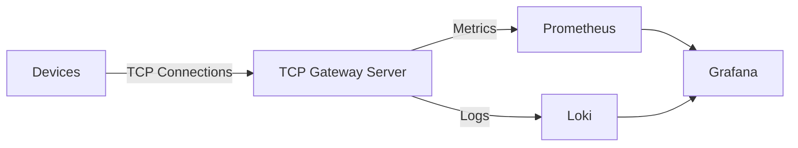

# Scalable TCP Device Gateway


**Status:** Actively under development.

> Designed to simulate real-world IoT gateway workloads under high concurrency.

High-performance, zero-allocation TCP server designed to handle thousands of concurrent device connections with minimal overhead.

> 🚀 High-concurrency TCP gateway built with .NET and System.IO.Pipelines  
> 📊 Full observability with Prometheus, Grafana, and Loki  
> ⚡ Designed for zero allocations and maximum throughput


### 🚀 Overview

This is a **high-concurrency TCP server** designed to handle thousands of simultaneous device connections with minimal
overhead. It serves as a robust gateway for IoT or industrial device communication.

- **Tracks:** Login, Heartbeat, and Disconnect messages.
- **Metrics:** Exposes Prometheus metrics for real-time monitoring.
- **Visualization:** Integrated with Grafana dashboards.
- **Logging:** Centralized logging using **Grafana Loki**.
- **Performance:** Built with **.NET 10 (LTS)** and `System.IO.Pipelines`.

---

### ❓ Why this project?

Efficiently handling thousands of TCP connections is a common challenge in IoT and industrial systems.

This project demonstrates:

- Building high-throughput, low-allocation TCP gateways in .NET
- Maintaining full observability with metrics, logs, and dashboards
- Applying advanced concurrency and performance patterns

---

### 🛠 Tech Stack

- **Framework:** .NET (latest)
- **Networking:** `System.IO.Pipelines` (High-performance I/O)
- **Monitoring:** Prometheus & Grafana
- **Logging:** Grafana Loki
- **CI/CD:** GitHub Actions
- **Infrastructure:** Docker Compose (Monitoring Stack)

---

### ✨ Key Features

- Handles **thousands of concurrent TCP connections**
- **Zero-allocation message parsing & encoding**
- Built-in **Prometheus metrics**
- Full **observability stack (Grafana + Loki)**
- **Device simulator** for load testing
- Dockerized monitoring environment

---

### 📂 Project Structure

```text
├── Gateway.Server/          # Core TCP engine (Pipelines & socket handling)
├── Gateway.Protocol/        # Protocol parsing & encoding
├── Gateway.Protocol.Tests/  # Unit tests & benchmarks
├── Benchmarks/              # BenchmarkDotNet suites
├── Gateway.Monitoring/      # Metrics & observability logic
├── Device.Simulator/        # Load testing tool
├── Dashboards/              # Grafana dashboards & images
├── prometheus/              # Prometheus configuration
└── docker-compose.yaml      # Monitoring stack setup
```

---

### ⚡ Performance & Design Highlights

- Zero-Allocation Parsing: Uses `System.IO.Pipelines` and `ReadOnlySequence<byte>` to process streams without intermediate allocations
- Memory-Efficient Encoding: Encoders write directly into `PipeWriter`, 0 bytes allocated per message
- Low-Overhead Payloads: `readonly record structs` for stack-based data and value equality
- Asynchronous Backpressure: Uses `ValueTask` and `FlushAsync` to handle slow consumers without blocking threads


<details>
<summary><b>🚀 Benchmark Metrics (Zero-Allocation)</b></summary>

| Operation | Encoding | Decoding | Total Latency | Allocated |
|:----------|:---------|:---------|:--------------|:----------|
| Ack       | 1.07 ns  | 36.71 ns | 37.78 ns      | 0 B       
| Heartbeat | 14.07 ns | 54.55 ns | 68.62 ns      | 0 B       |
| Login     | 18.24 ns | 64.29 ns | 82.53 ns      | 0 B       |

Note: Achieved zero GC pressure via `System.IO.Pipelines` and `Span<byte>` under extreme load.
</details>

---

### 🏗 Architecture Notes

- **Strict Protocol Validation:** Prevents buffer overflow or "Slowloris"-style attacks
- **Thread-Safe Sessions:** High-performance concurrent collections manage device contexts safely

---

### 🏗 Architecture Diagram


---

<details>
<summary><b>📊 Dashboard & Observability</b></summary>
  
Real-time monitoring via Grafana dashboards linked with Prometheus metrics and Loki logs.


#### Metrics Exposed

- `gateway_devices_expected_total`: The target number of devices configured for this simulation run.
- `gateway_active_connections`: Current established TCP sessions.
- `gateway_logins_total`: Total successful handshakes completed.
- `gateway_heartbeats_total`: Total heartbeats processed.
- `gateway_disconnects_total`: Count of socket closures, including both simulated drops and server-side disconnects.
- `gateway_login_duration_seconds`: Latency tracking for handshake sequences.
- `gateway_heartbeat_duration_seconds`: Tracks how long the server takes to respond to a heartbeat request.

</details>

---

## 🎯 What This Demonstrates

- High-concurrency network server design
- Low-level performance optimization in .NET
- Real-world observability (metrics + logs + dashboards)
- Production-style system design and deployment

---

### 🔄 Connection Lifecycle

1. **Connect:** Device establishes a TCP socket.
2. **Login:** Device must send a valid `Login` message within a defined window to be registered.
3. **Stay Alive:** Device sends periodic `Heartbeat` messages to maintain the session.
4. **Disconnect:** Automatically handled when the socket is closed or a heartbeat timeout is triggered.

---

### 📋 Prerequisites

- .NET SDK (8 or later)
- Docker & Docker Compose

---

### ⚡ How to Run
> Make sure Docker is running before starting the monitoring stack.

#### 1. Start Monitoring Stack

```bash
docker-compose up
```

- Prometheus: http://localhost:9090
- Grafana: http://localhost:3000 (Default: admin/admin)

#### 2. Run the Server

```bash
dotnet run --project Gateway.Server/Gateway.Server.csproj
```

- Source Code: [Gateway.Server.csproj](./Gateway.Server/Gateway.Server.csproj)
- Verify Metrics: http://localhost:2222

#### 3. Run the Simulator

```bash
dotnet run --project Device.Simulator/Device.Simulator.csproj
```

- Source Code: [Device.Simulator.csproj](./Device.Simulator/Device.Simulator.csproj)
- Verify Metrics: http://localhost:3333

#### 4. Import Dashboards

1. Open Grafana and go to **Dashboards → Import**.
2. Import one of the following JSON files from the `Dashboards/` directory:
    - `Dashboards/Images/ScalableTcpDeviceGateway_Metrics.json`
    - `Dashboards/Images/DeviceGateway_Logs.json`
    - `Dashboards/Images/DeviceSimulator_Logs.json`
3. Paste the JSON model or upload the file and click **Import**.

--- 

### Troubleshooting

- Ensure Loki container is running and Serilog points to correct endpoint
- Make sure Grafana dashboards load — all Docker containers must be running

---

### 🚧 Future Improvements

- TLS for secure device communication
- Horizontal scaling (multi-instance gateway)
- Kafka / RabbitMQ integration
- Advanced rate limiting & device throttling

