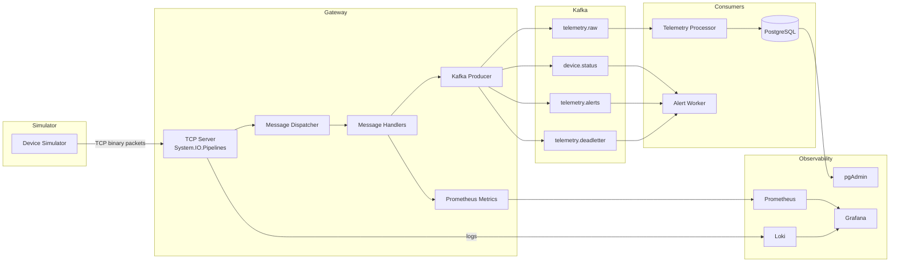
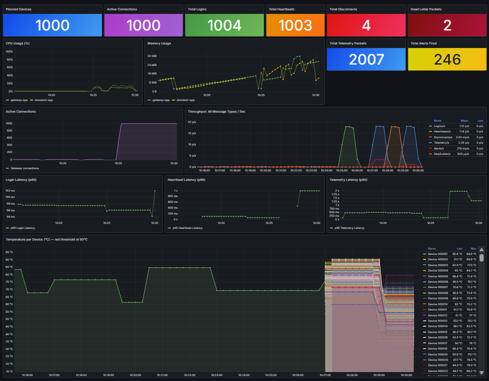
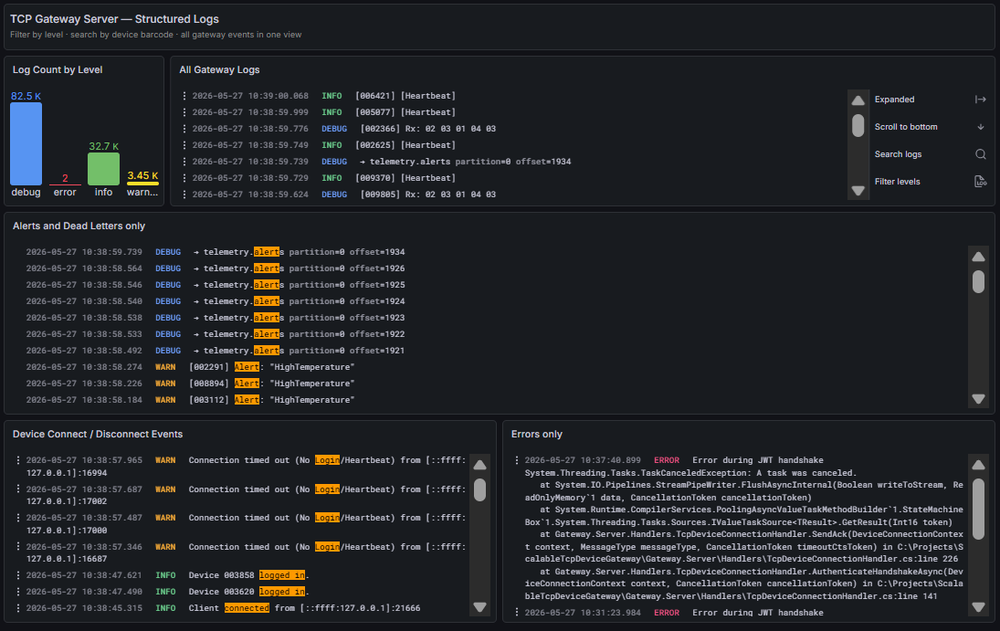
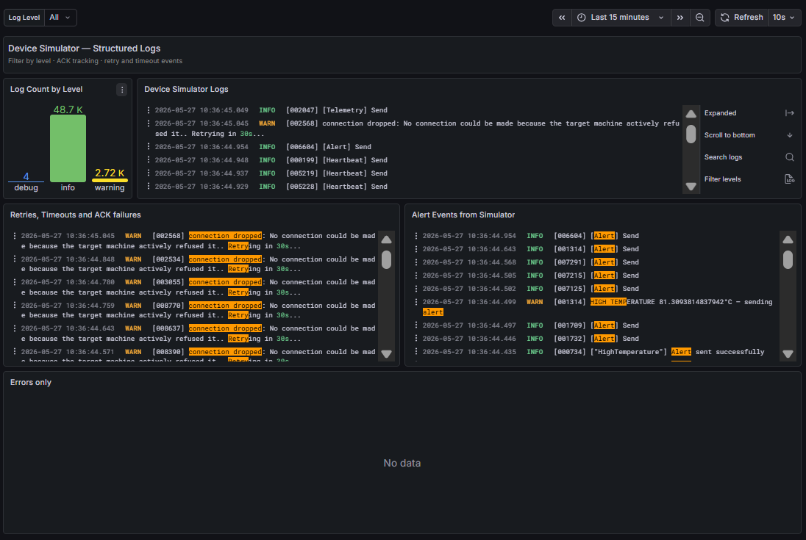
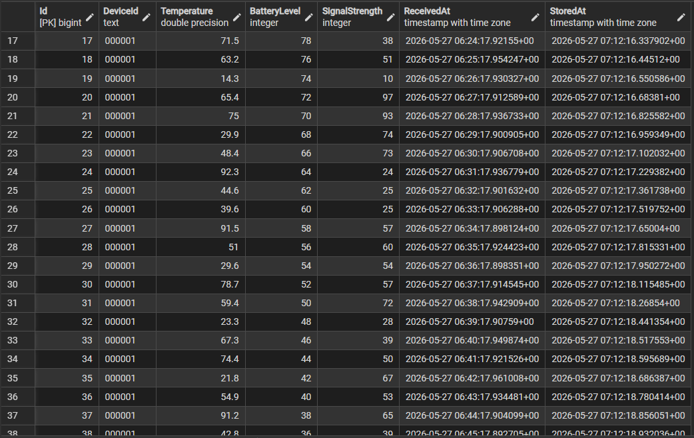

# Scalable TCP IoT Gateway — Kafka Distributed Systems


**Status:** Actively under development.

---

## Overview

A high-performance IoT telemetry platform capable of 50k+ concurrent TCP connections, achieving near-zero allocation on
the hot path via .NET 10 and `System.IO.Pipelines`. The gateway validates and parses binary sensor packets, publishes
events into Apache Kafka, and fan-outs to asynchronous consumer services for processing and alerting.

---

## Why this project?

In IoT and industrial automation, handling thousands of concurrent "chatty" devices is a common bottleneck. Traditional
`async/await` patterns over standard streams can lead to high GC pressure and memory fragmentation under extreme load.
Downstream processing that runs in the same process as the TCP server creates coupling and limits scalability.

This project demonstrates:

- **High-Performance Networking:** Engineering a zero-copy TCP provider using `System.IO.Pipelines` to eliminate GC
  overhead.
- **Distributed Event Pipeline:** Decoupling TCP ingestion from processing using Apache Kafka topics and independent
  consumer services.
- **Binary Protocol Design:** A custom framed binary protocol with checksum validation, multiple packet types.
- **Cloud-Native Observability:** A "Golden Signals" monitoring stack with Prometheus, Grafana, and Loki across all
  services.
- **Advanced Concurrency:** Managing thousands of stateful device sessions using thread-safe, low-overhead patterns.

---

## How the system works — end to end

```
Temperature Sensor Simulator
        │
        │  TCP binary packets  :8888
        ▼
TCP Gateway Server
        │  validates checksum
        │  parses binary buffer
        │  dispatches to handlers
        ├──► Prometheus metrics
        └──► Kafka producer
                    │
                    ▼
           Apache Kafka Broker
                    │
        ┌───────────┼───────────────┐
        ▼           ▼               ▼
  telemetry.raw  device.status  telemetry.deadletter
        │           │               │
        ▼           └───────────────┘
  Telemetry                 Alert Worker
  Processor                       │
        │                         │
        ▼                         ▼
   PostgreSQL               Structured Logs
  (EF Core)                    (Loki)
```

---

## Service Responsibilities

### Device Simulator

Simulates industrial IoT temperature sensors. Runs as a console application, spawning N concurrent device connections
each running their own send loop.

Sends:

- **Login** — first packet after TCP connect, registers the device identity
- **Telemetry** — carries temperature, battery level, signal strength
- **Heartbeat** — proves the device is alive
- **Alert** — when temperature exceeds 80°C, battery drops below 10%, or signal drops below 15

Receives:

- **ACK** — gateway confirms every valid packet

After 3 failed ACKs or a timeout the simulator closes the socket and retries after 30 seconds.

---

### TCP Gateway Server

The core of the system. Accepts raw TCP connections, speaks the binary protocol, and acts as the Kafka producer. Runs as
a .NET hosted service using `System.IO.Pipelines` for zero-allocation I/O.

Responsibilities:

- Accept TCP clients and manage device sessions via `DeviceConnectionManager`
- Enforce login timeout — close connections that do not send a Login within 5 seconds
- Enforce heartbeat timeout — close sessions that go silent for 60 seconds
- Parse and validate every incoming binary packet (`PacketDecoderParserHelper`)
- Dispatch parsed payloads to keyed message handlers via `MessageDispatcher`
- Send ACK back to device after every valid packet
- Publish events to Kafka via `TelemetryKafkaProducer`
- Publish Prometheus metrics for every packet type

---

### Telemetry Processor

A .NET Worker Service that subscribes to `telemetry.raw`.
Processes every temperature reading published by the gateway
and persists it to PostgreSQL.

Responsibilities:

- Consume `telemetry.raw` topic
- Deserialise `TelemetryEvent` messages
- Write each reading to PostgreSQL via EF Core (`TelemetryReading` entity)
- Log each reading with device ID, temperature, battery, and signal
- Detect temperature anomalies (temperature > 80°C)
- Commit offsets only after successful `SaveChangesAsync` (at-least-once delivery)
- Auto-migrate database schema on startup

Consumer group: `telemetry-processor-group`

---

### Alert Worker

A .NET Worker Service that subscribes to `device.status`, `telemetry.alerts`, and `telemetry.deadletter`. Reacts to
device lifecycle events and bad packet reports.

Responsibilities:

- Consume `device.status` — log Connect, Heartbeat, Disconnect events
- Consume `telemetry.alerts` — log device-reported alerts with type and device ID
- Consume `telemetry.deadletter` — log raw bytes of invalid packets for debugging
- Fire warnings on device disconnects
- Extension point: send email/Slack/PagerDuty notifications

Consumer group: `alert-worker-group`

---

## Architecture Diagram


```mermaid
flowchart LR
    subgraph Simulator
        sim[Device Simulator]
    end

    subgraph Gateway
        tcp[TCP Server\nSystem.IO.Pipelines]
        dispatcher[Message Dispatcher]
        handlers[Message Handlers]
        producer[Kafka Producer]
        metrics[Prometheus Metrics]
    end

    subgraph Kafka
        raw[telemetry.raw]
        status[device.status]
        alerts[telemetry.alerts]
        dead[telemetry.deadletter]
    end

    subgraph Consumers
        proc[Telemetry Processor]
        alert[Alert Worker]
        db[(PostgreSQL)]
    end

    subgraph Observability
        prom[Prometheus]
        grafana[Grafana]
        loki[Loki]
        pgadmin[pgAdmin]
    end

    sim -->|TCP binary packets| tcp
    tcp --> dispatcher --> handlers
    handlers --> producer
    handlers --> metrics
    producer --> raw
    producer --> status
    producer --> alerts
    producer --> dead
    raw --> proc
    proc --> db
    status --> alert
    alerts --> alert
    dead --> alert
    metrics --> prom --> grafana
    tcp -->|logs| loki --> grafana
    db --> pgadmin
```

---

## Observability & Monitoring

### Gateway Metrics Dashboard

Real-time tracking of active sessions, packet throughput, and temperature per device:



### Gateway Logs Dashboard

Structured logs with alert and dead-letter filtered views:



### Simulator Logs Dashboard

Device simulator activity including retries, timeouts, and alert events:



### PostgreSQL — Telemetry Readings

Every sensor reading stored by the TelemetryProcessor consumer:



---

## Connection Lifecycle

1. **Connect** — Device opens a TCP socket. Gateway creates a session, starts login timeout.
2. **Login** — Device sends Login packet within 5 seconds. Gateway registers device identity, publishes `Connected` to
   `device.status`, sends ACK.
3. **Telemetry** — Device sends readings every 3 seconds. Gateway parses, publishes to `telemetry.raw`, sends ACK.
4. **Heartbeat** — Device sends heartbeat every 30 seconds. Gateway resets timeout, publishes to `device.status`, sends
   ACK.
5. **Alert** — Device detects a threshold breach, sends Alert packet. Gateway publishes to `telemetry.alerts`, sends
   ACK.
6. **Disconnect** — Socket closes (graceful or timeout). Gateway publishes `Disconnected` to `device.status`, cleans up
   session.
7. **Bad packet** — Checksum or parse failure. Gateway publishes to `telemetry.deadletter`.

---

## Project Structure

```
├── Gateway.Server/               # TCP server — Pipelines, session management, Kafka producer
├── Gateway.Protocol/             # Binary protocol — parsers, encoders, checksum, packet types
├── Gateway.Protocol.Tests/       # Unit tests for protocol parsing and encoding
├── Gateway.Monitoring/           # Shared Prometheus metrics library used by all services
├── Kafka.Producer/               # Kafka producer wrapper — Confluent.Kafka, topic publish methods
├── Kafka.Contracts/              # Shared Kafka event DTOs and topic name constants
├── TelemetryProcessor/           # Worker Service — consumes telemetry.raw, writes to PostgreSQL
├── AlertWorker/                  # Worker Service — consumes device.status and deadletter
├── Device.Simulator/             # High-concurrency IoT device simulator
├── Benchmarks/                   # BenchmarkDotNet hot-path performance suites
├── k8s/                          # Kubernetes manifests
│   ├── namespace.yaml
│   ├── deployment.yaml
│   └── service.yaml
├── Metrics/                      # Monitoring configuration
│   ├── grafana/
│   │   └── provisioning/
│   │       ├── dashboards/
│   │       │   ├── dashboards.yml
│   │       │   └── json/
│   │       │       ├── device-gateway-simulator-metrics.json
│   │       │       ├── device-gateway-logs.json
│   │       │       └── device-simulator-logs.json
│   │       └── datasources/
│   │           └── datasources.yml
│   ├── prometheus/
│   ├── loki/
│   └── images/
├── gateway.bat                   # Main CLI controller — see Getting Started
├── docker-compose.yaml           # Infrastructure + .NET services (profile-based)
├── Dockerfile                    # Multi-stage chiseled .NET build
└── .dockerignore
```

---

## Prerequisites

- .NET 10 SDK
- Docker Desktop

---

## Getting Started

The project has two run modes controlled by `gateway.bat` in the root directory.
The **Device Simulator always runs outside Docker** regardless of mode.

---

### Mode 1 — Local (infrastructure in Docker, .NET services via dotnet run)

Best for active development. You get breakpoints, hot reload, and fast iteration
on all three .NET services while Kafka, Postgres, and monitoring run in Docker.

**What runs where:**

```
Docker:       Kafka · Zookeeper · Kafka UI · PostgreSQL · pgAdmin
              Prometheus · Loki · Grafana
dotnet run:   Gateway.Server
dotnet run:   TelemetryProcessor
dotnet run:   AlertWorker
Your shell:   Device.Simulator  (run separately when ready)
```

**Start:**

```bat
gateway local
```

This starts the infrastructure containers, waits for Kafka to be ready,
then opens three separate terminal windows — one for each .NET service.

**Then run the simulator in a fourth terminal:**

```bash
dotnet run --project Device.Simulator/Device.Simulator.csproj
```

---

### Mode 2 — Docker (everything in Docker)

Best for testing the full stack end to end. All .NET services are containerised.
Only the simulator runs outside.

**What runs where:**

```
Docker:       Kafka · Zookeeper · Kafka UI · PostgreSQL · pgAdmin
              Prometheus · Loki · Grafana
              Gateway.Server · TelemetryProcessor · AlertWorker
Your shell:   Device.Simulator  (run separately when ready)
```

**Start:**

```bat
gateway docker
```

This builds the Docker images for all three .NET services and starts everything.

**Then run the simulator:**

```bash
dotnet run --project Device.Simulator/Device.Simulator.csproj
```

---

### Stop everything

```bat
gateway stop
```

---

### Status

```bat
gateway status
```

---

## Ports

| Service          | Port   | URL                   |
|------------------|--------|-----------------------|
| Gateway TCP      | `8888` | —                     |
| Metrics endpoint | `2222` | —                     |
| Kafka            | `9092` | —                     |
| Kafka UI         | `8080` | http://localhost:8080 |
| Prometheus       | `9090` | http://localhost:9090 |
| Grafana          | `3000` | http://localhost:3000 |
| Loki             | `3100` | —                     |
| PostgreSQL       | `5432` | —                     |
| pgAdmin          | `5050` | http://localhost:5050 |

Grafana credentials: `admin` / `admin`
pgAdmin credentials: `admin@admin.com` / `admin`

### Kubernetes Mode (NodePorts)

| Service          | Port    |
|------------------|---------|
| Gateway TCP      | `30888` |
| Metrics endpoint | `30222` |

When running in Kubernetes mode the `Device.Simulator` must target NodePort `30888`.

---

## Implementation Milestones

- [x] TCP server accepts concurrent connections via System.IO.Pipelines
- [x] Binary packet parser with zero-allocation hot path
- [x] Device session manager with heartbeat timeout tracking
- [x] Prometheus metrics across all packet types
- [x] Grafana dashboards — metrics and logs
- [x] Device simulator — login, telemetry, heartbeat, alerts, status, disconnect
- [x] Kafka producer integrated into gateway handlers
- [x] TelemetryProcessor consumer service
- [x] AlertWorker consumer service
- [x] Dead-letter queue for invalid packets
- [x] Kafka UI for real-time topic inspection
- [x] PostgreSQL storage via EF Core in TelemetryProcessor
- [x] pgAdmin for visual database inspection
- [x] Profile-based Docker Compose for local and full-stack modes
- [ ] Channel-based buffering to fully decouple Kafka from hot path
- [ ] TLS for secure device communication
- [ ] Advanced rate limiting & device throttling

